# gtestcov Workflow

Round 02 note: the lightweight environment check is `gtestcov codrax doctor`.
A bare `gtestcov codrax-check` is a compatibility alias for that doctor-style
check. `gtestcov codrax-check --quick` validates explicit target/build-file
inputs, and `gtestcov codrax-check --deep` is the only deep repository citation
probe. The workflow should not imply that `codrax-check` defaults to deep
analysis.

Evidence is collected in layers: local file index, bulk symbol scan, optional
search backend, optional semantic backend, and CODRAX where configured. Zoekt,
Serena, clangd, and ccls remain optional PoC/fallback paths; they are not
required for the default workflow. CODRAX consumes scoped evidence for synthesis
and deeper judgment rather than acting as the only search or understanding
engine.

This Markdown workflow is the authoritative current workflow description.
`gtestcov_workflow.drawio` is the editable diagram source. The release package
does not include a rendered PNG workflow image.

这份文档对应 `gtestcov_workflow.drawio`。当前流程是 6 段泳道：一次性接入、证据同步、任务生成、弱 AI 执行、门禁验证、覆盖率补洞闭环。

```mermaid
flowchart LR
  A["version / install doctor"] --> B["init：生成 profile、OpenCode command、MCP 配置"]
  B --> C["OpenCode /gtest-cover 调用 gtestcov MCP"]

  C --> D["用户输入 target、coverage goal、build-file anchor"]
  D --> E["codrax doctor / codrax-check --quick"]
  E --> F["profile-sync：用 CODRAX file:line 更新 project_profile.yaml"]
  F --> G{"证据可信并匹配 build-file anchor？"}
  G -->|"否"| H["manual_review_needed.md：停止，不猜测项目事实"]
  G -->|"是"| I["profile_evidence.md + project_profile.yaml"]

  I --> J["cover：推荐单目标入口"]
  J --> K["analyze：测试类型判定"]
  K --> L["test_obligations：必须覆盖的场景和断言"]
  L --> M["task.md：受限任务包"]
  M --> N["opencode_permission_warmup + memory-refresh"]

  M --> O["OpenCode + MiniMax 执行"]
  O --> P["只改 tests / test_support / 受控 .gtestcov artifacts"]
  P --> Q{"需要生产代码测试缝？"}
  Q -->|"是"| R["source_change_request.md：停止等待确认"]
  Q -->|"否"| S["modified_files.txt + review_checklist.md"]

  S --> T["check：preflight 快检"]
  T --> U{"preflight 通过？"}
  U -->|"否"| V["preflight_fix_task.md"]
  V --> O
  U -->|"是"| W["verify：build / test / gcovr XML / audit"]
  W --> X["verify.json + coverage_history.json"]
  X --> Y{"覆盖率目标达成？"}
  Y -->|"是"| Z["完成：保留可追溯产物"]
  Y -->|"否"| AA["next-round：生成 next_task.md"]
  AA --> AB{"连续低收益？"}
  AB -->|"是"| AC["stagnation_report.md：停止"]
  AB -->|"否"| O
```

## 图中关键规则

- 通用层保持通用：只依赖 C/C++、GTest/GMock、覆盖率解析、CLI/MCP 流程和工具自身护栏。
- 项目事实必须来自用户输入、`project_profile.yaml`、CODRAX `file:line` 证据或 gtestcov 可追溯产物。
- `cover` 是推荐的单目标入口，会串起 `profile-sync`、coverage goal、`analyze`、任务包与 OpenCode 权限预热。
- 弱 AI 默认只修改测试侧路径；需要生产代码测试缝时写 `source_change_request.md` 并停止。
- `check` 是编译前快检；不通过时只生成修复任务，不进入昂贵的 build/test/coverage。
- `next-round` 按 `coverage_mapping_blocked`、`bootstrap`、`characterization`、`branch_expansion`、`precision_closure` 推进补洞。
