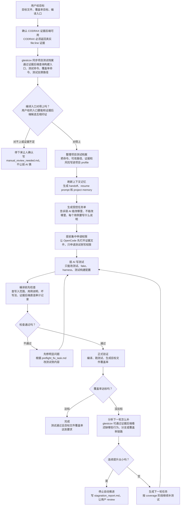

# gtestcov Workflow

这张图用大白话解释 `gtestcov` 在做什么。

推荐用法：

- 看图和手动改图：打开 `docs/gtestcov_workflow.drawio`，用 <https://app.diagrams.net/>。
- 放进 README 或 GitHub 文档：使用下面这个 Mermaid 版本。
- 对外分享：从 diagrams.net 导出 PNG、SVG 或 PDF。

## 大白话版流程

用户先告诉工具：我要覆盖哪个文件、目标覆盖率是多少、我认为哪个文件或脚本是编译入口。

然后 `gtestcov` 不让弱 AI 直接乱翻项目，而是由 `gtestcov` 作为主控层，通过证据后端向 CODRAX 发起受控问题。CODRAX 只提供带 `file:line` 的项目证据；真正负责裁剪证据、更新 profile、生成任务单、约束弱 AI 的还是 `gtestcov`。弱 AI 只能按任务单改测试侧文件。

写完测试后，工具不会马上编译。它先做一次快速检查：有没有改业务代码、有没有缺用例说明、有没有越界写文件、有没有明显依赖编造。检查通过后才编译、跑测试、看覆盖率。

如果覆盖率不够，工具会按当前覆盖率阶段规划下一轮；如果连续几轮提升很小，就停下来让用户 review。

为了避免弱 AI 刷新或压缩上下文后丢失记忆，`gtestcov` 会维护上下文记忆层：当前任务用 `handoff.md` 和 `resume_prompt.md` 接续，跨任务复用的项目经验写入 `project_memory.md`。这些文件由 `gtestcov` 生成，弱 AI 只读，不能直接修改。

所有项目细节都不能靠猜。通用层只放 C/C++、GTest/GMock、覆盖率解析、CLI/MCP 流程和工具自身约束；构建入口、测试目录、fake/harness/support、业务模块边界、平台接口、项目根目录含义等必须来自用户输入、`project_profile.yaml`、CODRAX `file:line` 证据或可追溯的 `gtestcov` 产物。

## Mermaid 图

## 这张图里几个关键词

- **gtestcov**：主控层，负责提问、裁剪证据、整理 profile、限制弱 AI、检查改动、跑验证和规划下一轮。
- **CODRAX**：证据后端，显著提高弱 AI 理解真实项目代码的能力，负责按 `gtestcov` 的问题返回带 `file:line` 的项目证据。
- **OpenCode / 弱 AI**：负责写测试，但只能在允许的测试侧路径里写。
- **上下文记忆层**：由 `gtestcov` 生成 `handoff.md`、`resume_prompt.md` 和 `project_memory.md`，让弱 AI 刷新上下文后先读这些文件再继续。
- **preflight**：编译前检查，省掉很多无意义的长时间编译。
- **next round**：覆盖率没达到时，规划下一轮，不让弱 AI 盲目加测试。
- **项目细节不猜测**：项目根、构建入口、测试支撑路径、平台接口等必须有用户输入、profile、CODRAX `file:line` 或 `gtestcov` 产物支撑。
